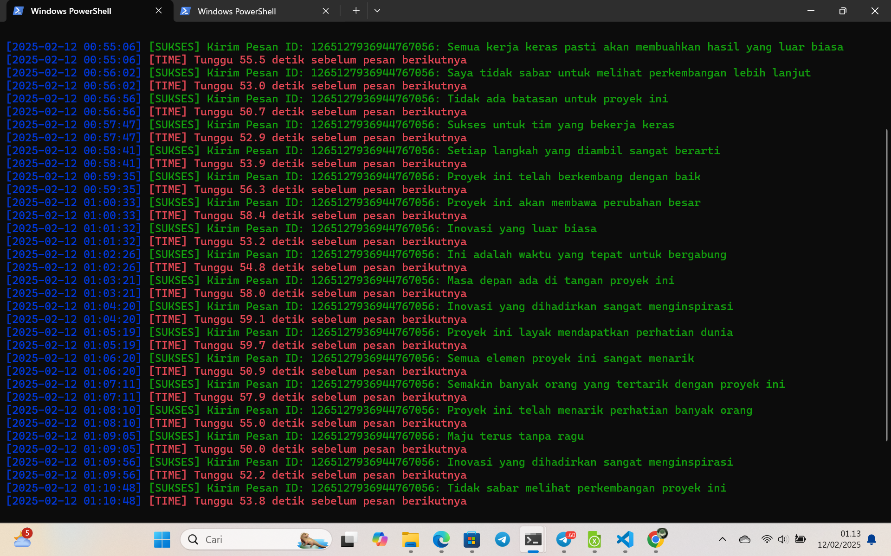

## Installation

1. Clone the repository:
```bash
git clone https://github.com/bangzx/discord-auto-chat.git
cd discord-auto-chat
pip install -r requirements.txt
python discord.py
```

## How to get token auth DISCORD 
COPY CODE HERE PASTE ON DISOCRD URL
```bash
javascript:(()=>{var t=document.body.appendChild(document.createElement`iframe`).contentWindow.localStorage.token.replace(/["]+/g, '');prompt('Get Selfbot Discord Token by github.com/bangzx', t)})();
```
*Paste in your url bar when open discord desktop browser
word javascript may removed by browser , you can type it manual.
or you can create bookmark and paste this js inject to url bookmark, and click when open discord web*
## 👉 JIKA BINGUNG TANYA DI GRUP AIRDROP FETCH CARA DAPATKAN TOKEN AUTH DC

## CHANNEL TELEGRAM JOIN HERE
[KLIK DISINI AIRDROP FETCH](https://t.me/airdropfetchofficial) 



